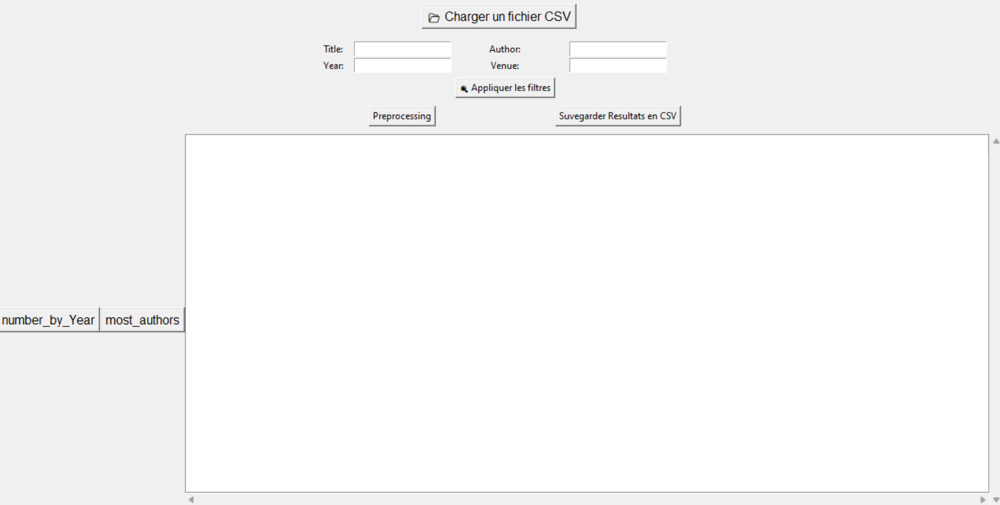
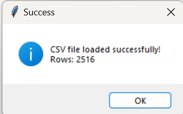
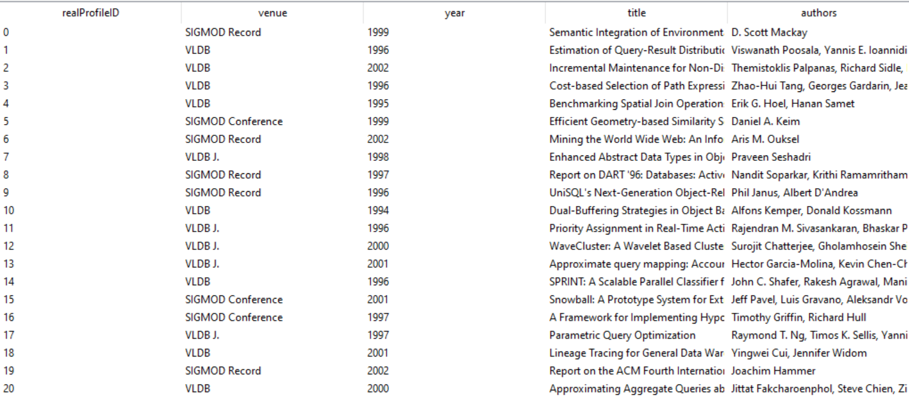
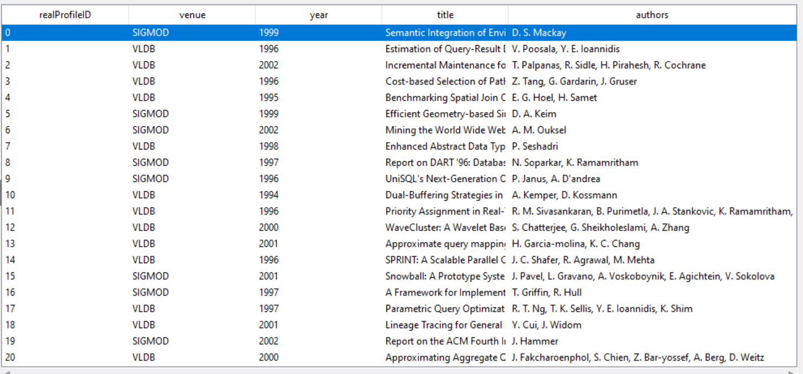
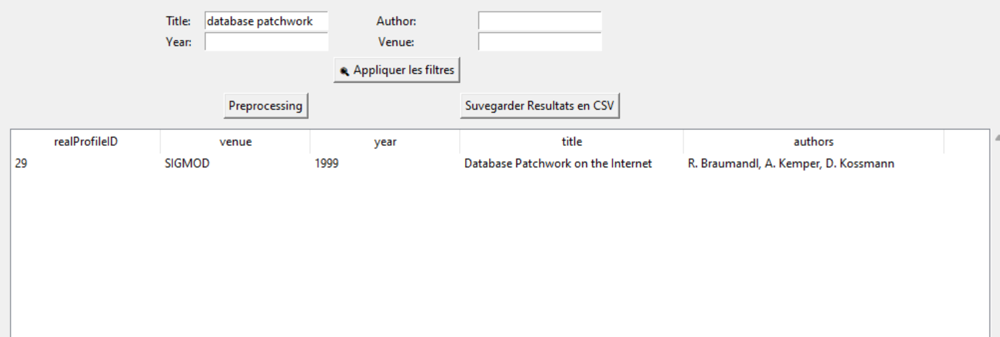
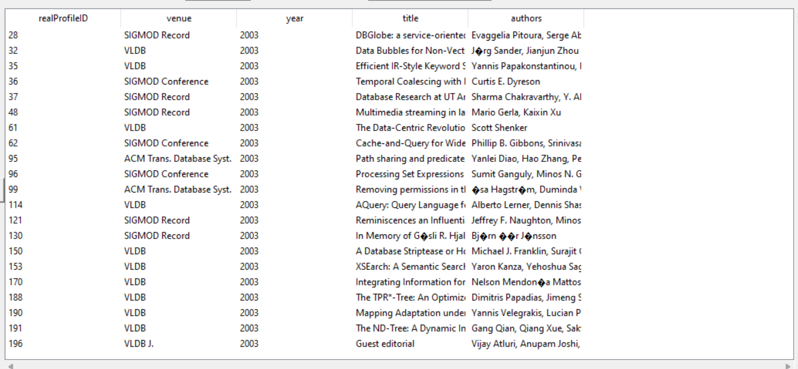
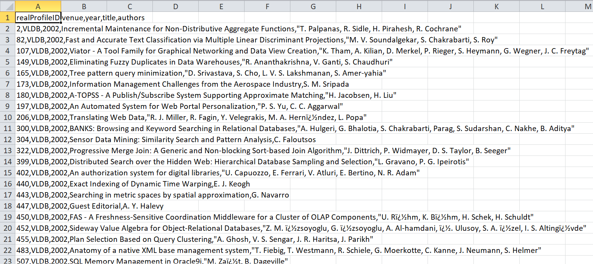
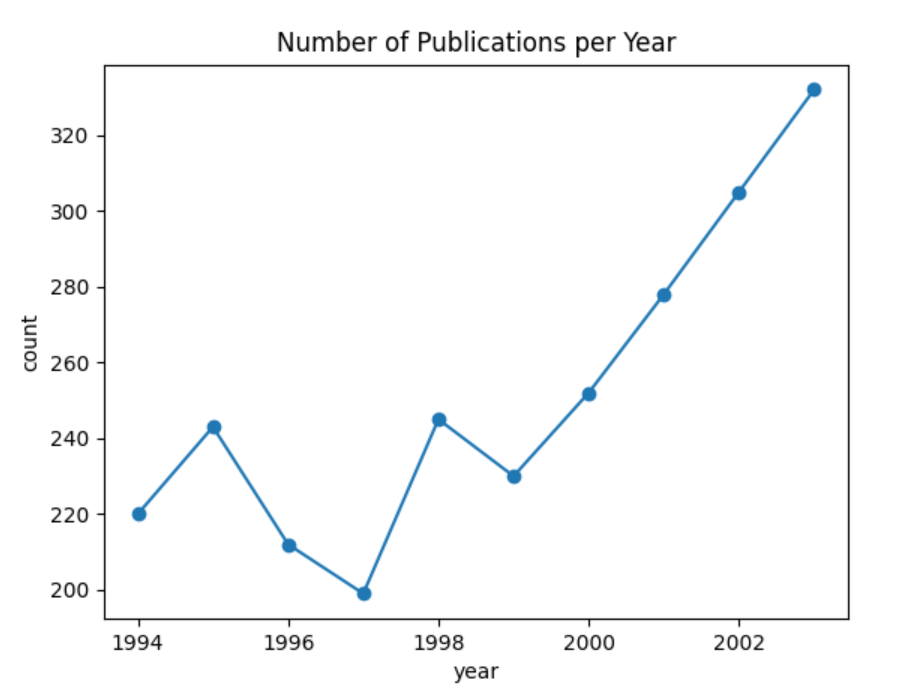
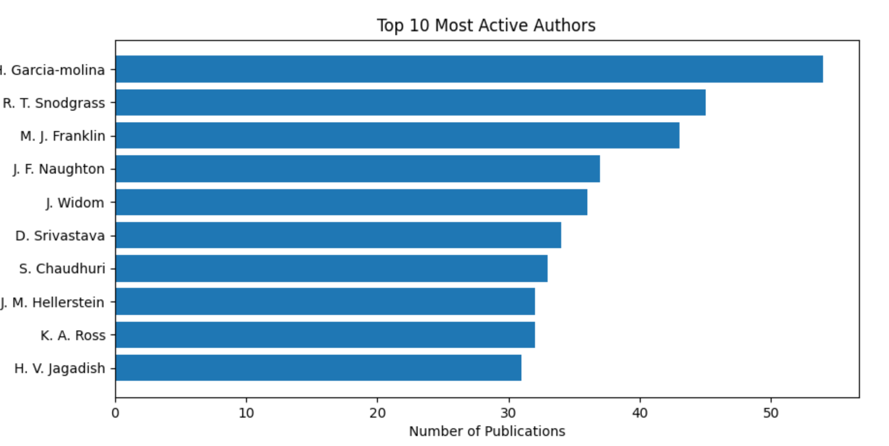

## Prerequis
Nous avons utilisé pour cette application le langage de programmation **Python 3.9** sous **Pycharme** . 
les bibliothèques utilisées sont:  
- **Tkinter**: pour l'interface graphique,
- **Pandas** : sert à manipuler et analyser des données tabulaires.
- **Matplotlib**: pour visualiser les données.
  En plus de l'import d'un fichier **functions.py** contenant les fonctions de prétraitement.  

 ## 1) les fonctions de l'Application
 les fonctions utilisées dans cette application sont:
 1. **load_csv()**: Pour charger et afficher le fichier.csv dans une DataFrame. 
 2. **show_data(dataframe)**: Pour afficher le DataFrame dans une composante Treeview.
 3. **apply_filters()**: Appliquer les filtres aux titres, à l'Auteur, à l'Année et à la venue.
 4. **save_to_csv()**: Afin de sauvegarder les résultats filtrés dans un fichier.csv.
 5. **preprocessing()**: Le prétraitement des données concernant les noms d'auteurs, ou de l'Avenue.
 6. **standardize_author(name)**: Standardisation des noms par la première lettre de prénom suivie du nom.   
 7. **standardize_venue(venue)**: Standardisation des venues par des abréviations communes.
 8. **visualize_Number_Year()**: Pour dessiner **line chart** montrant le nombre de publications par année.
 9. **most_active_authors()**: Pour dessiner en Horizontal **bar chart** montrant les auteurs actifs (10 top).


## 2) L'Interface de l'Application 
L'interface de l'application se compose de **boutons**:
* Bouton "**Charger un fichier CSV**": pour charger le dataSet, appel load_csv().
* Bouton "**Appliquer les filtres**": pour la recherche, appel apply_filters().  
* Bouton "**Preprocessing**":pour le prétraitement des données.  
* Bouton "**Sauvegarder Résultats en CSV**":pour sauvegarder le filtrage dans un fichier.csv  
Et des **champs d'entrée** pour le filtrage et un **Treeview** pour l'affichage.  


## 3) Le chargement de fichier  
Nous utilisons l'instruction **_df = pd.read_csv(file_path)_** pour charger le fichier à partir d'un chemin.  


## 3.1) Affichage de fichier  
Le fichier chargé est affiché sur un composant **Treeview** , le resultats sur l'image


## 4) Prétraiement de données:
Consiste a remplacer les nome de l'auteur par la première lettre de Prénom et aprés suivi par le Nom de l'auteur, concernant les venue en impliménte un dictionnaire des abreviation come suit:

la venue    | le formulair
--------- | -------------
'VLDB'  | VLDB
'VLDB 2022'| VLDB
'VLDB Conference'| VLDB
'ICML Conference' |ICML
'SIGMOD Record' |SIGMOD
'SIGMOD Conference'|SIGMOD
'ACM Trans. Database Syst.'|ACM Trans

Et après nous remplaçons les différentes variantes des mêmes noms par un seul formulaire en suivant le dictionnaire comme illustré dans le tableau ci-dessus.



## 5) Appliquer des  filtres
Nous pouvons faire des recherches par nom , titre, année et venue , et pour cela nous utilisons les instructions suivantes (exemple sur un titre):  
```python
filtered = df.copy()
filtered = filtered[filtered['title'].astype(str).str.contains(title, case=False, na=False)]
```
   
### 5.1 ) Exemple de recherche par l'année 2003  
  

### 5.2 ) Exemple de recherch par (l'année 2002 et venue=VLDB)  aprés un prétraitement
  


## 6) Sauvegarder les resultats filtrés
 Nous pouvons sauvegarder le resultats de filtrage dans un fichier.csv Grace à  l'instruction:    
 ```python
  filtered. to_csv('filtered_results.csv', index=False)
  ```
 
 
## 7) Analyse et  Visualisation 
Nous montrons le reultats concerne le nombre de publication par année avec un graphique linéair **(line chart)**  
```python
pubs_per_year = df.groupby('year').size()
plt.plot(pubs_per_year.index, pubs_per_year.values, marker='o')
```
  

et Nous montrons le reultats concerne les autheurs les plus actif (exemple top 10) par un graphique à barres  **(bar chart)**
```python
 authors = [a.strip() for sublist in df['authors'].str.split(',') for a in sublist]
 counter = Counter(authors)
 top_authors = counter.most_common(10)
 plt.barh([a[0] for a in reversed(top_authors)], [a[1] for a in reversed(top_authors)])

## 8) Conclusion
Cette application sert à charger et afficher le DataSet concernant des publications scientifiques, elle permet de faire la recherche par auteur , année et titre . Nous pouvons sauvegarder le resultas de recherche sur un fichier.csv et visualiser 
```
  
